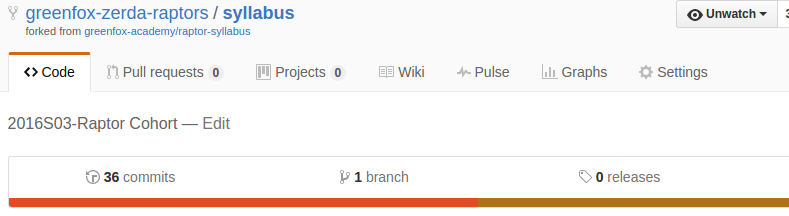
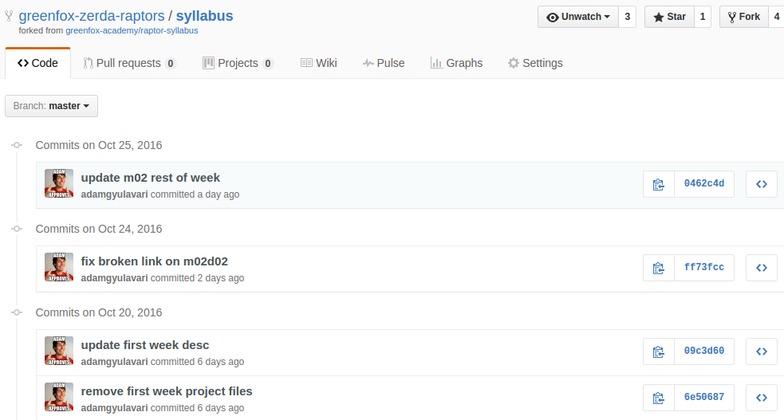

# How to leave the feedback on Github
- You can't leave comments on actual files in the repositories (since those should be final)
- But you can write comments on the lines of commits.
- Here's how.

## Go to the repo you want to review

## Click on Commits

## Click on a commit

## Here you can click on a line and a comment form will pop up
